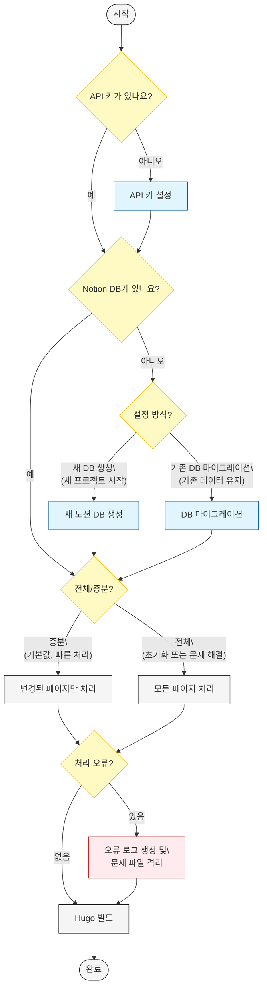

# Notion-Hugo 상세 설정 가이드

노션 데이터베이스/페이지를 마크다운으로 변환하고, Hugo 빌드 전 오류 파일을 처리하여 완전한 빌드 파이프라인을 제공하는 Python 애플리케이션입니다.

## ✅ 주요 특징

### 🧠 스마트 동기화 시스템
- **자동 모드 선택**: 커밋 메시지, 브랜치명, 실행 종류(스케줄, 수동)에 따라 `incremental` 또는 `full-sync` 모드를 자동으로 선택합니다.
- **키워드 기반 제어**: 커밋 메시지에 `[full-sync]` 또는 `[force-rebuild]` 키워드를 포함하여 전체 재빌드를 수동으로 트리거할 수 있습니다.
- **브랜치 기반 제어**: 브랜치명에 `full-sync`가 포함된 경우 자동으로 전체 동기화를 실행합니다.
- **안정성 강화**: GitHub Actions에서 커밋 메시지를 가져오지 못할 경우를 대비한 fallback 로직이 포함되어 있습니다.

### 🔗 URL 리디렉션 및 SEO 최적화
- **자동 리디렉션**: 과거 URL 패턴(`_posts/`, `/post/` 등)으로 들어온 요청을 현재 URL 구조(`/posts/`)로 자동 리디렉션하여 404 오류를 방지합니다.
- **SEO 점수 보존**: 301 영구 리디렉션을 통해 기존 URL의 SEO 점수를 새로운 URL로 이전합니다.
- **클라이언트/서버 지원**: `_redirects`, `.htaccess` 등 서버 레벨 설정과 404 페이지의 클라이언트 사이드 스크립트를 모두 지원하여 어떤 환경에서도 동작합니다.

### 🔄 증분 렌더링
- Notion 페이지의 `last_edited_time`과 콘텐츠 해시를 기반으로 변경된 페이지만 선별하여 처리합니다.
- `.notion-hugo-state.json` 파일에 증분 정보를 저장하고, GitHub Actions 캐시를 통해 빌드 간 상태를 유지합니다.
- **문제 해결 도구**: 캐시 문제 발생 시 간단한 키워드로 전체 재빌드를 실행할 수 있습니다.

### 🧼 저장소 구조
- Markdown, 상태파일 등은 `.gitignore` 처리 → GitHub 저장소는 항상 깨끗하게 유지됨
- 오직 최종 Hugo 빌드 결과물(`./public/`)만 GitHub Pages로 배포됨

### 🚀 자동화 배포 (GitHub Actions)
- 완전한 워크플로우 하나로 통합: Notion → Hugo 빌드 → GitHub Pages 배포
- 워크플로우 실행 시 `.notion-hugo-state.json`을 캐시에서 복원해 증분 유지
- **스마트 모드 감지**: 실행 컨텍스트에 따라 최적의 동기화 방식 자동 선택

### 🛠️ 문제 해결 도구
- **Shortcode 호환성 수정**: Hugo에서 지원하지 않는 shortcode 자동 변환
- **레거시 파일 정리**: UUID 기반 과거 파일들 자동 백업 및 정리
- **디버그 정보**: 상세한 로그로 문제 진단 지원

## 핵심 기능

이 섹션에서는 Notion-Hugo 파이프라인의 핵심 기능을 설명합니다. 이 기능들은 모든 사용자에게 필수적인 기본 워크플로우를 제공합니다.

### 노션-Hugo 동기화

노션-Hugo 파이프라인의 핵심 기능은 노션의 콘텐츠를 Hugo 웹사이트로 변환하는 것입니다:

```bash
# 기본 동기화 (변경된 페이지만 처리)
python notion_hugo_app.py

# 콘텐츠 변환 후 사이트 확인 (Hugo 서버 모드)
python notion_hugo_app.py --hugo-args="server --disableFastRender"
```

이 명령은 다음 작업을 자동으로 수행합니다:

1. **노션 콘텐츠 가져오기**: 노션 API를 통해 데이터 추출
2. **마크다운 변환**: 노션 블록을 Hugo 호환 마크다운으로 변환
3. **Hugo 빌드**: 변환된 마크다운을 사용하여 정적 사이트 생성

### 증분 처리 옵션

성능 최적화를 위해 증분 처리가 기본 설정되어 있습니다:

| 옵션 | 명령어 | 설명 | 사용 시점 |
|------|--------|------|----------|
| **증분 처리** | `--incremental` | 변경된 페이지만 처리 (기본값) | 일상적인 사용 |
| **전체 처리** | `--full-sync` | 모든 페이지 강제 재처리 | 초기화 또는 문제 해결 시 |
| **변경 확인** | `--dry-run` | 변경사항만 확인 (실제 변환 없음) | 영향 범위 확인 시 |

```bash
# 모든 페이지 강제 재처리
python notion_hugo_app.py --full-sync

# 변경사항만 확인 (실제 변환 없음)
python notion_hugo_app.py --dry-run
```

### Hugo 빌드 및 배포

Hugo 빌드 단계를 세밀하게 제어할 수 있습니다:

```bash
# Notion 변환만 실행 (Hugo 빌드 없음)
python notion_hugo_app.py --notion-only

# Hugo 전처리 및 빌드만 실행
python notion_hugo_app.py --hugo-only

# Hugo에 추가 인자 전달
python notion_hugo_app.py --hugo-args="server -D --bind=0.0.0.0 --port=8080"
```

### 노션-휴고 속성 매핑

노션 데이터베이스의 속성과 Hugo 프론트매터 사이의 매핑 관계는 다음과 같습니다:

#### 최소한 속성 (Minimal Properties)
블로그 게시에 필수적인 기본 속성들입니다. 이것만 있어도 Hugo 블로그 발행이 가능합니다.

| 노션 속성 | Hugo 프론트매터 | 설명 | 기본값 |
|-----------|----------------|------|---------|
| **Name** (title) | `title` | 페이지 제목 | "Untitled" |
| **Date** (date) | `date` | 발행일 | 생성 시간(`created_time`) |
| (시스템) | `notion_id` | 노션 페이지 ID | 페이지 ID |

#### 추천 속성 (Recommended Properties)
블로그 관리와 퀄리티를 위해 사용하는 것이 좋은 속성들입니다.

##### 콘텐츠 제어 속성
| 노션 속성 | Hugo 프론트매터 | 설명 |
|-----------|----------------|------|
| **skipRendering** (checkbox) | - | 노션→마크다운 변환 단계에서 이 페이지를 완전히 건너뜀 |
| **isPublished** (checkbox) | `draft` | true면 공개(draft=false), false면 초안(draft=true) 상태로 설정 |
| **expiryDate** (date) | `expiryDate` | 만료일 (이 날짜 이후에는 사이트에서 제거됨) |

##### 메타데이터 속성
| 노션 속성 | Hugo 프론트매터 | 설명 | 기본값/대체값 |
|-----------|----------------|------|--------------|
| **description** (text) | `description` | 페이지 설명 (메타 태그용, SEO에 중요) | - |
| **summary** (text) | `summary` | 콘텐츠 요약 (미리보기에 사용) | `description` 값 |
| **lastModified** (date) | `lastmod` | 마지막 수정일 | `last_edited_time` |
| **slug** (text) | `slug` | URL 경로 | 제목에서 자동 생성 |
| **author** (text) | `author` | 작성자 | - |
| **weight** (number) | `weight` | 페이지 정렬 순서 (낮을수록 먼저 표시) | - |

##### 분류 속성
| 노션 속성 | Hugo 프론트매터 | 설명 | 기본값/대체값 |
|-----------|----------------|------|--------------|
| **categories** (multi-select) | `categories` | 카테고리 분류 (주요 분류) | - |
| **tags** (multi-select) | `tags` | 태그 목록 (세부 분류) | - |
| **keywords** (text) | `keywords` | SEO 키워드 (검색엔진용) | `tags` 값 |

##### 테마 지원 속성
테마에 따라 지원 여부가 달라질 수 있는 속성들입니다.

| 노션 속성 | Hugo 프론트매터 | 설명 |
|-----------|----------------|------|
| **featured** (checkbox) | `featured` | 특별히 강조할 게시물 여부 (테마마다 지원 다름) |
| **subtitle** (text) | `subtitle` | 부제목 (일부 테마에서 지원) |
| **linkTitle** (text) | `linkTitle` | 링크에 표시될 짧은 제목 |
| **layout** (text) | `layout` | 사용할 템플릿 레이아웃 |

> **참고**: 속성 이름은 대소문자를 구분하지 않습니다. 예를 들어 "Tags", "tags" 또는 "TAGS"는 모두 동일하게 처리됩니다.

## 고급 기능

이 섹션에서는 Notion-Hugo 파이프라인의 고급 기능을 설명합니다. 이 기능들은 특별한 요구사항이 있는 사용자를 위한 추가 기능입니다.

### 데이터베이스 설정

데이터베이스 설정에는 두 가지 방법이 있습니다:

1. **대화형 모드** (권장):
   ```bash
   python notion_hugo_app.py -i
   ```
   화면의 안내에 따라 진행하면 됩니다.

2. **명령줄 옵션**:
   ```bash
   # 워크스페이스 루트에 데이터베이스 생성
   python notion_hugo_app.py --setup-db --db-name="Hugo Blog Posts"
   
   # 특정 페이지 아래에 데이터베이스 생성
   python notion_hugo_app.py --setup-db --parent-page=YOUR_PAGE_ID --db-name="Hugo Blog Posts"
   ```

### 데이터베이스 마이그레이션

이미 노션 데이터베이스가 있지만 이 도구의 구조에 맞지 않는 경우, 마이그레이션을 사용합니다:

1. **대화형 모드** (권장):
   ```bash
   python notion_hugo_app.py -i
   ```
   안내에 따라 "기존 노션 데이터베이스 마이그레이션" 옵션을 선택하세요.

2. **명령줄 옵션**:
   ```bash
   # 워크스페이스 루트로 마이그레이션
   python notion_hugo_app.py --migrate-db --source-db=SOURCE_DB_ID
   
   # 특정 페이지로 마이그레이션
   python notion_hugo_app.py --migrate-db --source-db=SOURCE_DB_ID --parent-page=TARGET_PAGE_ID
   ```

> **참고**: 데이터베이스 설정과 마이그레이션은 서로 대체 관계입니다. 기존 콘텐츠를 유지하려면 마이그레이션을, 새로 시작하려면 데이터베이스 설정을 선택하세요.

## 스마트 동기화 사용법

### 커밋 메시지로 모드 제어

GitHub Actions에서 자동으로 동기화 모드를 선택합니다:

```bash
# 전체 재빌드 (캐시 문제 해결)
git commit -m "Fix cache issues [full-sync]"
git push origin main

# 강제 재빌드 (대규모 변경 후)
git commit -m "Major content update [force-rebuild]"
git push origin main

# 일반 업데이트 (기본 incremental 모드)
git commit -m "Add new blog post"
git push origin main
```

### 브랜치명으로 모드 제어

```bash
# 브랜치명에 full-sync 포함 시 자동으로 전체 동기화
git checkout -b hotfix/full-sync-cache-fix
git push origin hotfix/full-sync-cache-fix
```

### 수동 실행

GitHub Actions에서 "Run workflow" 버튼 클릭 시 자동으로 full-sync 모드로 실행됩니다.

### 로컬에서 전체 재빌드

```bash
# 로컬에서 전체 강제 재빌드 실행
chmod +x scripts/force-full-rebuild.sh
./scripts/force-full-rebuild.sh
```

## 문제 해결 도구

### Shortcode 호환성 문제

```bash
# Hugo에서 지원하지 않는 shortcode 자동 수정
chmod +x scripts/fix-shortcodes.sh
./scripts/fix-shortcodes.sh
```

### 레거시 파일 정리

```bash
# UUID 기반 과거 파일들 정리
chmod +x scripts/cleanup-legacy-files.sh
./scripts/cleanup-legacy-files.sh
```

### 상세 가이드

- **`docs/smart-sync-usage-guide.md`** - 스마트 동기화 상세 사용법
- **`docs/troubleshooting-sync-mode.md`** - 동기화 모드 문제 해결
- **`docs/immediate-action-plan.md`** - 즉시 실행 가이드
- **`docs/cache-cleanup-guide.md`** - 캐시 정리 종합 가이드

## 전체 흐름도



### 테스트

```bash
python notion_hugo_app.py --dry-run
```

## 개발 및 운영

### Docker 및 CI/CD 환경

GitHub Actions 워크플로우 예시를 확인하려면 [DEPLOYMENT_OPTIONS.md](DEPLOYMENT_OPTIONS.md)를 참조하세요.

### 로그 및 모니터링

애플리케이션은 다음과 같은 로깅 기능을 제공합니다:

- **변환 로그**: 변환 과정의 각 단계를 기록
- **오류 문서**: `docs/build_errors.json`에 빌드 실패 항목 기록
- **문제 파일 격리**: 문제가 있는 파일을 `data/error_temp/` 디렉토리에 저장

로그 레벨 설정:
```bash
# 자세한 로그 출력
python notion_hugo_app.py --verbose

# 오류 메시지만 출력
python notion_hugo_app.py --quiet
```

### 테스트 및 품질 관리

#### 단위 테스트 실행

```bash
# 모든 테스트 실행
python -m unittest discover

# 특정 모듈 테스트
python -m unittest tests.test_notion_api
```

#### 코드 품질 확인

```bash
# 린터 실행
flake8 src

# 타입 검사
mypy src
```

## 참조

### 노션 ID 이해하기

노션에서는 두 종류의 ID가 있으며, 이들을 구분하는 것이 중요합니다:

| ID 유형 | 설명 | 사용 시점 |
|--------|------|----------|
| **페이지 ID** | 노션의 개별 페이지를 식별합니다. | `--parent-page` 옵션 사용 시 |
| **데이터베이스 ID** | 노션 데이터베이스를 식별합니다. | `--source-db` 옵션 사용 시, DB 마운트 설정 시 |

### ID 찾는 방법

1. **URL에서 찾기**: 
   - 노션 페이지/DB 열기 → URL 확인
   - 형식: `https://www.notion.so/{workspace}/{ID}`
   - 예: `https://www.notion.so/myworkspace/8a021de72bda434db255d7cc94ebb567`
   - ID는 32자리 16진수로, 하이픈이 있거나 없을 수 있음

2. **대화형 모드에서 쉽게 사용**:
   - `python notion_hugo_app.py -i` 실행
   - URL을 붙여넣으면 자동으로 ID 추출

### 문제 해결

#### Notion API 오류

- **증상**: "NOTION_TOKEN 환경 변수가 설정되지 않았습니다" 또는 API 권한 오류
- **해결**:
  1. `.env` 파일에 올바른 토큰이 설정되어 있는지 확인
  2. 노션 통합에 필요한 권한이 부여되었는지 확인 (Read/Update/Insert)
  3. 통합이 데이터베이스와 공유되었는지 확인 (노션 UI에서 "공유" 메뉴)

#### ID 구분 관련 문제

- **증상**: "소스 데이터베이스를 찾을 수 없습니다" 또는 ID 관련 오류
- **해결**:
  1. 대화형 모드 (`-i` 플래그)를 사용하여 ID 검증 활용
  2. DB ID와 페이지 ID를 올바른 곳에 사용했는지 확인
  3. 노션 URL에서 올바르게 ID를 추출했는지 확인

#### 증분 처리 관련 문제

- **증상**: 동기화 오류 또는 일부 콘텐츠 누락
- **해결**:
  1. `--full-sync` 옵션으로 전체 동기화 실행
  2. 손상된 메타데이터 파일이 의심되면 `.notion-hugo-state.json` 삭제 후 재실행

#### Hugo 빌드 오류

- **증상**: Hugo 빌드 오류 또는 렌더링 문제
- **해결**:
  1. Hugo가 시스템에 설치되어 있는지 확인
  2. Hugo 테마가 올바르게 설치되었는지 확인
  3. 문제 파일은 `docs/build_errors.json`에서 확인할 수 있습니다

### 프로젝트 구조

```
notion-hugo-py/
├── notion_hugo_app.py    # 메인 실행 파일
├── notion-hugo.config.yaml # 설정 파일
├── src/                  # 소스 코드
│   ├── notion_api.py     # Notion API 통합
│   ├── markdown_converter.py # 마크다운 변환
│   ├── hugo_processor.py # Hugo 전처리 및 빌드
│   ├── notion_hugo.py    # 메인 파이프라인 로직
│   ├── file.py           # 파일 처리
│   ├── metadata.py       # 증분 처리 메타데이터
│   ├── notion_setup.py   # 노션 DB 설정/마이그레이션
│   ├── types.py          # 타입 정의
│   ├── render.py         # 렌더링 유틸리티
│   ├── config.py         # 설정 관리 
│   ├── helpers.py        # 헬퍼 유틸리티
│   ├── cli_utils.py      # CLI 유틸리티
│   └── ...
└── ...
```

각 모듈은 독립적인 책임을 가지며, 모듈 간 의존성을 최소화하였습니다:

- **notion_api.py**: Notion API 액세스 및 데이터 추출 담당
- **markdown_converter.py**: Notion 블록을 마크다운으로 변환
- **hugo_processor.py**: Hugo 빌드 프로세스 관리
- **notion_hugo.py**: 전체 파이프라인 통합 및 조정
- **metadata.py**: 증분 처리를 위한 상태 관리
- **notion_setup.py**: 데이터베이스 설정 및 마이그레이션 로직

## 라이선스

GPL-3.0
