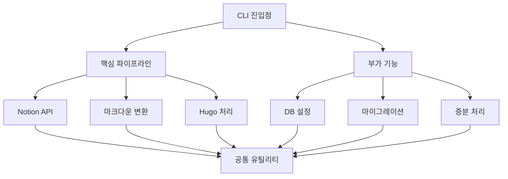

# Notion-Hugo 아키텍처 개선 계획

## 현재 구조 분석

현재 코드베이스는 다음과 같은 주요 모듈로 구성되어 있습니다:

- `notion_hugo.py`: 메인 파이프라인 로직
- `notion_api.py`: Notion API 통합
- `markdown_converter.py`: Notion 블록을 마크다운으로 변환
- `hugo_processor.py`: Hugo 전처리 및 빌드
- `render.py`: Notion 페이지를 마크다운으로 렌더링 및 저장
- `metadata.py`: 증분 처리를 위한 상태 관리
- `notion_setup.py`: 데이터베이스 설정 및 마이그레이션
- `file.py`: 파일 처리 유틸리티
- `helpers.py`: 공통 유틸리티 함수
- `cli_utils.py`: CLI 관련 유틸리티

현재 구조에서는 핵심 파이프라인과 부가 기능이 명확하게 분리되어 있지 않으며, 일부 모듈은 다양한 책임을 갖고 있습니다.

## 개선된 아키텍처 설계

20년 경력의 소프트웨어 엔지니어 관점에서, 다음과 같이 모듈화를 극대화하고 핵심 파이프라인과 부가 기능을 명확히 분리하는 구조로 개선합니다:

### 1. 핵심 파이프라인 모듈 (Core Pipeline)

```
core/
  ├── __init__.py              # 핵심 파이프라인 인터페이스 정의
  ├── notion_api.py            # Notion API 통합 (간소화)
  ├── markdown_converter.py    # 마크다운 변환 엔진
  ├── hugo_processor.py        # Hugo 통합 처리
  └── pipeline.py              # 메인 파이프라인 로직
```

### 2. 부가 기능 모듈 (Additional Features)

```
features/
  ├── __init__.py              # 부가 기능 공통 인터페이스
  ├── db_setup.py              # 데이터베이스 설정
  ├── migration.py             # 마이그레이션 기능
  ├── incremental.py           # 증분 처리 로직
  └── error_handling.py        # 고급 오류 처리
```

### 3. 공통 유틸리티 모듈 (Common Utilities)

```
utils/
  ├── __init__.py              # 유틸리티 공통 인터페이스
  ├── file_utils.py            # 파일 처리 유틸리티
  ├── logging.py               # 로그 및 모니터링
  ├── config.py                # 설정 관리
  └── cli.py                   # CLI 인터페이스
```

## 개선 접근 방식

### 1단계: 핵심 파이프라인 분리 및 모듈화
- 핵심 기능(Notion 데이터 가져오기, 마크다운 변환, Hugo 빌드)을 명확하게 분리
- 각 모듈의 역할과 책임을 명확히 정의
- 핵심 모듈은 최소한의 외부 의존성만 갖도록 설계

### 2단계: 부가 기능 모듈화
- 데이터베이스 설정, 마이그레이션, 증분 처리 등의 부가 기능을 별도 모듈로 분리
- 플러그인 방식으로 핵심 파이프라인에 연결될 수 있도록 설계

### 3단계: 공통 인터페이스 및 로깅 표준화
- 일관된 로깅 및 오류 처리 전략 적용
- 모듈 간 소통을 위한 표준 인터페이스 정의
- 문서화 개선 및 사용자 안내서 업데이트

## 모듈 간 의존성 설계



## 인터페이스 및 상호작용 설계

각 모듈은 명확한 인터페이스를 통해 상호작용하며, 의존성 주입(Dependency Injection) 패턴을 활용하여 모듈 간 결합도를 최소화합니다. 특히 다음과 같은 설계 원칙을 적용합니다:

1. **인터페이스 분리 원칙**: 각 모듈은 자신이 실제로 사용하는 메서드만 포함하는 인터페이스에 의존
2. **단일 책임 원칙**: 각 모듈은 하나의 책임만 가짐
3. **개방-폐쇄 원칙**: 확장에는 열려있고 수정에는 닫혀있는 설계
4. **의존성 역전 원칙**: 고수준 모듈이 저수준 모듈에 의존하지 않도록 함

## 개선 이점

1. **유지보수성 향상**: 모듈화를 통해 코드 변경의 영향 범위 최소화
2. **테스트 용이성**: 독립적인 모듈로 단위 테스트 작성 용이
3. **확장성**: 새로운 기능 추가가 용이한 플러그형 구조
4. **문서화**: 명확한 책임 분리로 문서화 개선
5. **사용자 경험**: 핵심 기능과 고급 기능의 구분으로 사용자 이해도 향상
